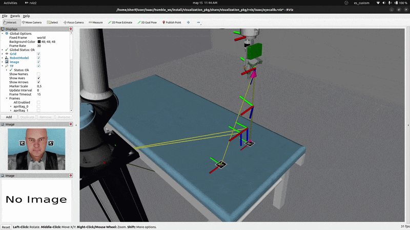

# Visual Control Package

[](https://docs.ros.org/en/humble/index.html)
[](https://scipy.org/)
[](https://pytorch.org/)
[](https://pytorch3d.org/)
[](https://developer.nvidia.com/kaolin)
[](https://github.com/opencv/opencv)
[](https://docs.ultralytics.com/models/sam-2)
[](https://github.com/facebookresearch/sam2)
[](https://wandb.ai/)
[](https://libeigen.gitlab.io/)
[](https://github.com/artivis/manif)
[](https://visp.inria.fr/)
[](https://www.orocos.org/kdl.html)
[](https://web.casadi.org/)
[](https://docs.acados.org/index.html)

### Differentiable Rendering-Based Visual Control Framework for Robotic Manipulation and Automated Intravitreal Eye Injections

<p align="center">
  
  
  
</p>

---

## Overview

A modular ROS 2 framework for **vision-guided robotic manipulation using differentiable rendering (DR)** as the primary perception backend. The project was developed to support automated intravitreal eye injections, a challenging robotic task requiring high precision under strict safety requirements.

The framework combines **differentiable-rendering-based perception, state estimation, visual servoing, inverse kinematics, and optimal-control-based trajectory optimization** into a unified software ecosystem. Differentiable rendering is used for pose optimization directly from image observations, enabling model-based perception and calibration workflows that are tightly integrated with the control stack.

The repository is organized as a collection of ROS 2 packages that separate **calibration, perception, estimation, planning & control, visualization, logging, and experimentation** workflows. At its core, the project provides reusable **C++ and Python** backends for filtering, visual servoing, inverse kinematics, differentiable rendering, segmentation, optimization, experiment management, and plotting utilities. Additional packages provide support for experiment logging, hyperparameter sweeps, robot descriptions, visualization, and system-level launch configurations.

The system supports **multiple operational modes**, including **standard autonomous operation, automated hand-eye calibration, and eye calibration** through multi-view differentiable-rendering-based optimization of eye geometry and texture. Together, these components form a complete perception-to-control pipeline for precision robotic manipulation tasks.

---

## Features

* **Modular ROS 2 (Humble) architecture** composed of 10 interoperable packages
* **Differentiable rendering-based perception** using NVIDIA Kaolin and PyTorch3D
* **Pose-based visual servoing** for vision-guided robotic manipulation using ViSP
* **Inverse kinematics** using OROCOS KDL
* **Extended Kalman Filter (EKF) and Low-Pass Filter (LPF)** implementations using **Manif**
* **Optimal-control-based trajectory optimization** using CasADi and acados
* **Multi-view eye calibration** through joint optimization of geometry and texture
* **Automated hand-eye calibration** workflows
* **AprilTag-based localization** and calibration support
* **Image and live-video segmentation** pipelines using SAM2
* **Experiment logging** to Console, CSV, and Weights & Biases (WandB)
* **Hyperparameter optimization** and sweep support using WandB
* **RViz visualization** of robot states, trajectories, plans, and detections
* **Python utilities** for metrics, objective functions, optimization, and plotting
* **Unified launch system** for deployment, calibration, and experimentation

---

## Table of Contents

* [Installation Instructions](#installation-instructions)
* [Repository Structure](#repository-structure)
    * [Main Packages](#main-packages)
    * [Auxiliary Packages](#auxiliary-packages)
* [Example Usage](#example-usage)
  * [Build and Source](#build-and-source)
  * [Main Operation](#main-operation)
  * [Hand-Eye Calibration](#hand-eye-calibration)
  * [Eye Calibration](#eye-calibration)
  * [Logging](#logging)
  * [Hyperparameter Sweeps](#hyperparameter-sweeps)
* [References](#references)

---

# Installation Instructions

TODO

---

# Repository Structure
This project comprises eight ROS 2 packages, organized into main and auxiliary packages as listed below.
These packages are supported by common C++ and Python libraries implemented within a [**core**](./vc_core/README.md) package.
Lastly, a [**system**](./system_pkg/README.md) package is used to orchestrate, configure, and launch these packages as a unified system for vision-based manipulator control under different operating modes.

## Main Packages

* [Calibration](./calibration_pkg/README.md)
* [Control & Planning](./control_pkg/README.md)
* [State Estimation](./state_estimation_pkg/README.md)
* [Vision/Perception](./vision_pkg/README.md)


## Auxiliary Packages

* [Robot Description](./robot_description_pkg/README.md)
* [Logging](./logging_pkg/README.md)
* [Hyperparameter Sweeps](./sweep_pkg/README.md)
* [Visualization](./visualization_pkg/README.md)

---

# Example Usage

## Build and Source

Build the workspace:

```bash
cd ~/ros2_ws
colcon build --symlink-install --cmake-args -DCMAKE_BUILD_TYPE=Release
```

Source the workspace:

```bash
source /opt/ros/humble/setup.bash
source ~/ros2_ws/install/setup.bash
```

---

## Main Operation

Launch the simulator (from [`eye_injection`](https://github.com/Sherif-Sameh/eye_injection) repo):

```bash
python scripts/ros2_agent.py \
    --enable_cameras \
    -c vs/base.toml \
    --headless
```

Launch the visual control system with differentiable rendering-based vision backend:

```bash
ros2 launch system_pkg main_isaac.launch.py
```

Or with the AprilTag-based vision backend:

```bash
ros2 launch system_pkg main_isaac.launch.py \
    estimator:=apriltag \
    detector:=apriltag \
    use_marker:=true
```

---

## Hand-Eye Calibration

Launch the simulator (from [`eye_injection`](https://github.com/Sherif-Sameh/eye_injection) repo):

```bash
python scripts/ros2_agent.py \
    --enable_cameras \
    -c vs_calib/he_calib.toml \
    --headless
```

Launch the hand-eye calibration workflow:

```bash
ros2 launch system_pkg hecalib_isaac.launch.py
```

---

## Eye Calibration

Launch the simulator (from [`eye_injection`](https://github.com/Sherif-Sameh/eye_injection) repo):

```bash
python scripts/ros2_agent.py \
    --enable_cameras \
    -c vs_calib/eye_calib.toml \
    --headless
```

Launch the eye calibration workflow:

```bash
ros2 launch system_pkg eyecalib_isaac.launch.py \
    model:=hashenc \
    dr_backend:=nvdiffrast
```

---

## Logging

In the following examples, loggers are used separately. However, they can be easily combined by setting their individual flags simultaneously. 

### Console Logging

```bash
ros2 launch system_pkg hecalib_isaac.launch.py \
    logger:=hecalib \
    console:=true \
    n_runs:=10
```

### CSV Logging

```bash
ros2 launch system_pkg main_isaac.launch.py \
    logger:=pbvs \
    csv:=true \
    n_runs:=10
```

### Weights & Biases Logging

```bash
ros2 launch system_pkg eyecalib_isaac.launch.py \
    logger:=eyecalib \
    wandb:=true \
    n_runs:=10
```

---

## Hyperparameter Sweeps

### Start a New Sweep

```bash
ros2 launch system_pkg hecalib_isaac.launch.py \
    sweep:=hecalib \
    n_runs:=100 \
    rviz:=false \   # disable RViz
    visualizers:=r  # disable trajectory/plan visualizations
```

### Continue an Existing Sweep

```bash
ros2 launch system_pkg hecalib_isaac.launch.py \
    sweep:=hecalib \
    n_runs:=100 \
    sweep_id:=0e9402r3 \    # replace with actual sweep id from W&B
    rviz:=false \           # disable RViz
    visualizers:=r          # disable trajectory/plan visualizations
```

---

# References

```bibtex
@article{ravi2020pytorch3d,
	title={Accelerating 3D Deep Learning with PyTorch3D},
	author={Nikhila Ravi and Jeremy Reizenstein and David Novotny and Taylor Gordon
	and Wan-Yen Lo and Justin Johnson and Georgia Gkioxari},
	journal={arXiv:2007.08501},
	year={2020},
}

@inproceedings{chen2019dibrender,
	title={Learning to Predict 3D Objects with an Interpolation-based Differentiable Renderer},
	author={Wenzheng Chen and Jun Gao and Huan Ling and Edward Smith and Jaakko Lehtinen and Alec Jacobson and Sanja Fidler},
	booktitle={Advances In Neural Information Processing Systems},
	year={2019},
}

@article{Laine2020diffrast,
	title={Modular Primitives for High-Performance Differentiable Rendering},
	author={Samuli Laine and Janne Hellsten and Tero Karras and Yeongho Seol and Jaakko Lehtinen and Timo Aila},
	journal={ACM Transactions on Graphics},
	year={2020},
}

@inproceedings{Falanga2018PAMPC,
	title={PAMPC: Perception-Aware Model Predictive Control for Quadrotors}, 
	author={Falanga, Davide and Foehn, Philipp and Lu, Peng and Scaramuzza, Davide},
	booktitle={2018 IEEE/RSJ International Conference on Intelligent Robots and Systems (IROS)}, 
	year={2018},
}
```